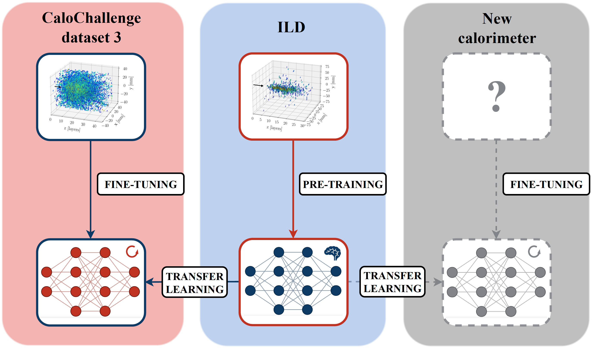

<a name="readme-top"></a>
# Cross-Geometry Transfer Learning for Fast Electromagnetic Shower Simulation

<div align="center">

Lorenzo Valente, Gregor Kasieczka, Frank Gaede

[](https://arxiv.org/abs/2511.XXXXX)
[](https://pytorch.org)
[](https://www.python.org)

</div>

<p align="center">
  
</p>

**Abstract:**  
Accurate particle shower simulation remains a critical computational bottleneck for high-energy physics.
Traditional Monte Carlo methods, such as \textsc{Geant4}, are computationally prohibitive, while existing machine learning surrogates are tied to specific detector geometries and require complete retraining for each design change or alternative detector. 
We present a transfer learning framework for generative calorimeter simulation models that enables adaptation across diverse geometries with high data efficiency. 
Using point cloud representations and pre-training on the International Large Detector detector, our approach handles new configurations without re-voxelizing showers for each geometry. 
On the \textsc{CaloChallenge} dataset, transfer learning with only 100 target-domain samples achieves a Wasserstein distance improvement of $44\%$ over training from scratch. 
Parameter-efficient fine-tuning with bias-only adaptation achieves competitive performance while updating only $17\%$ of model parameters. 
Our analysis provides insight into adaptation mechanisms for particle shower development, establishing a baseline for future progress of point cloud approaches in calorimeter simulation.

## Table of Contents

- [Setup](#setup)
- [Dataset](#dataset)
- [Training](#training)
- [Evaluation](#evaluation)
- [Citation](#citation)
- [Contact](#contact)


## Setup

### Requirements
- Python 3.12
- CUDA-capable GPU (CUDA  12.4)
- 16GB+ GPU memory recommended

### Installation

We recommend using conda for environment management:

```bash
conda env create -f environment.yml
conda activate calo-transfer
```


### Model Architecture

This work uses the CaloClouds II architecture, a geometry-independent diffusion model for point clouds generation. 
The base model implementation is from [FLC-QU-hep/CaloClouds-2](https://github.com/FLC-QU-hep/CaloClouds-2).

## Dataset

For detailed dataset specifications, preprocessing instructions, data formats, and geometric mismatch details, see [calotransfer/data/README.md](calotransfer/data/README.md)

## Training

### Pre-training on Source Domain (ILD)

Train the base model on ILD photon showers from [FLC-QU-hep/CaloClouds-2](https://github.com/FLC-QU-hep/CaloClouds-2).
The pre-trained weights are available at [link to be added].

### Transfer Learning to Target Domain

#### Full Fine-tuning
```bash
python calotransfer/scripts/train.py \
    --dataset_key calo_challenge \
    --dataset_size 100 \
    --use_pretrain true \

```

#### BitFit (Parameter-Efficient)
```bash
python calotransfer/scripts/train.py \
    --dataset_key calo_challenge \
    --dataset_size 100 \
    --use_pretrain true \
    --use_bitfit true \

```

#### LoRA (for comparison)
```bash
python calotransfer/scripts/train.py \
    --dataset_key calo_challenge \
    --dataset_size 100 \
    --use_pretrain true \
    --use_lora true \
    --lora_rank 16 \
    --lora_alpha 16 \

```

### Training from Scratch (Baseline)
```bash
python calotransfer/scripts/train.py \
    --dataset_key calo_challenge \
    --dataset_size 100 \
    --use_pretrain false \

```

## Evaluation

### Generate Showers
```bash
python calotransfer/scripts/evaluation/generation.py \
    --dataset_size 100 \
    --use_pretrained bitfit \
    --training_step 1000000 \
    --use_ema true \
    --lora_rank 16 \
    --lora_alpha 16
```

### Compute Metrics and Plot Results
```bash
python calotransfer/scripts/evaluation/plot_evaluate.py
```

See [calotransfer/scripts/evaluation/](calotransfer/scripts/evaluation/) for additional evaluation scripts and Jupyter notebooks.

## Citation

If you use this work, please cite:

```bibtex
@article{valente2025crossgeometry,
  title={Cross-Geometry Transfer Learning for Fast Electromagnetic Shower Simulation},
  author={Valente, Lorenzo and Kasieczka, Gregor and Gaede, Frank},
  journal={arXiv preprint arXiv:2511.XXXXX},
  year={2025}
}
```


## License

This project is licensed under the MIT License - see [`LICENSE`](LICENSE) for details.

## Contact

Lorenzo Valente - lorenzo.valente@uni-hamburg.de


<p align="right">(<a href="#readme-top">back to top</a>)</p>