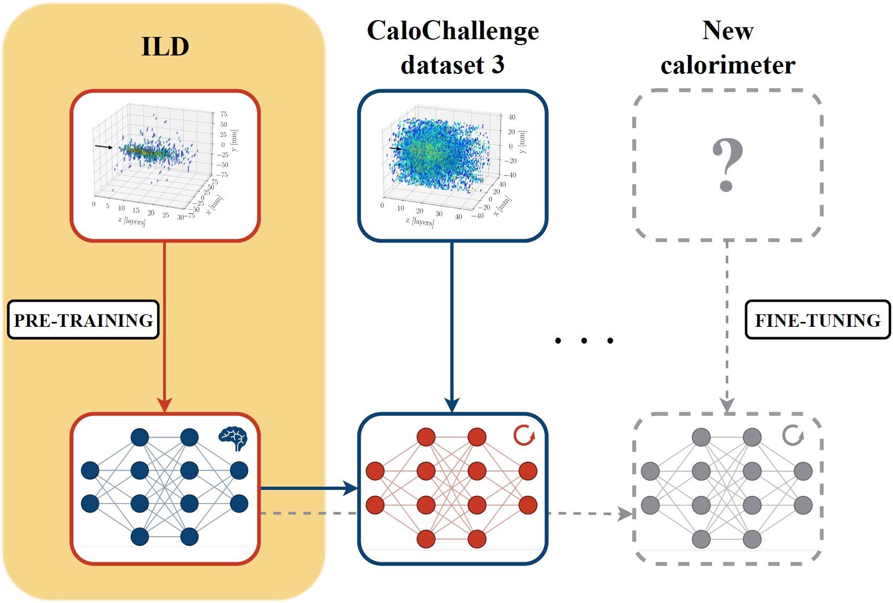

<a name="readme-top"></a>
# Cross-Geometry Transfer Learning for Fast Electromagnetic Shower Simulation

<div align="center">

Lorenzo Valente, Gregor Kasieczka, Frank Gaede

[](https://arxiv.org/abs/2511.XXXXX)
[](https://pytorch.org)
[](https://www.python.org)

</div>

<p align="center">
  
</p>

**Abstract:**  
Accurate particle shower simulation remains a critical computational bottleneck for high-energy physics. Traditional Monte Carlo methods like Geant4 are computationally prohibitive, while existing machine learning surrogates are tied to specific detector geometries and need complete retraining for each design change. We present a transfer learning framework that allows generative models to adapt across diverse calorimeter geometries with high data efficiency. Using point cloud representations and pre-training on the ILD detector, our approach handles new configurations without re-voxelizing showers for each geometry. On the CaloChallenge dataset, we achieve a **44% reduction in Wasserstein distance** compared to training from scratch with just 100 target-domain samples. Parameter-efficient fine-tuning with BitFit reaches 93% of full fine-tuning performance while updating only 17% of model parameters. Our singular value analysis reveals that LoRA, though successful in NLP, performs poorly for shower transformation layers in our architecture. These results establish single-detector pre-training as a practical alternative to multi-detector foundation models, offering a direct pathway for rapid adaptation to evolving detector designs while maintaining physical fidelity.

## Table of Contents

- [Setup](#setup)
- [Dataset](#dataset)
- [Training](#training)
- [Evaluation](#evaluation)
- [Citation](#citation)
- [Contact](#contact)


## Setup

### Requirements
- Python 3.12
- CUDA-capable GPU (CUDA  12.4)
- 16GB+ GPU memory recommended

### Installation

We recommend using conda for environment management:

```bash
conda env create -f environment.yml
conda activate calo-transfer
```


### Model Architecture

This work uses the CaloClouds II architecture, a geometry-independent diffusion model for point clouds generation. 
The base model implementation is from [FLC-QU-hep/CaloClouds-2](https://github.com/FLC-QU-hep/CaloClouds-2).

## Dataset

For detailed dataset specifications, preprocessing instructions, data formats, and geometric mismatch details, see [calotransfer/data/READ.ME](calotransfer/data/README.md)

## Training

### Pre-training on Source Domain (ILD)

Train the base model on ILD photon showers from [FLC-QU-hep/CaloClouds-2](https://github.com/FLC-QU-hep/CaloClouds-2). 
The pre-trained weights are 

### Transfer Learning to Target Domain

#### Full Fine-tuning
```bash
python scripts/transfer_learning.py \
    --checkpoint checkpoints/source_model/best.pt \
    --data data/target/electrons_calo_challenge.hdf5 \
    --method full \
    --n_samples 100 \
    --output checkpoints/full_finetuned
```

#### BitFit (Parameter-Efficient)
```bash
python scripts/transfer_learning.py \
    --checkpoint checkpoints/source_model/best.pt \
    --data data/target/electrons_calo_challenge.hdf5 \
    --method bitfit \
    --n_samples 100 \
    --output checkpoints/bitfit_finetuned
```

#### LoRA (for comparison)
```bash
python scripts/transfer_learning.py \
    --checkpoint checkpoints/source_model/best.pt \
    --data data/target/electrons_calo_challenge.hdf5 \
    --method lora \
    --rank 16 \
    --n_samples 100 \
    --output checkpoints/lora_finetuned
```

### Training from Scratch (Baseline)
```bash
python scripts/train_target.py \
    --data data/target/electrons_calo_challenge.hdf5 \
    --config configs/train_scratch.yaml \
    --n_samples 100 \
    --output checkpoints/scratch_baseline
```

## Evaluation

### Generate Showers
```bash
python scripts/generate.py \
    --checkpoint checkpoints/bitfit_finetuned/best.pt \
    --n_showers 10000 \
    --output results/generated_showers.hdf5
```

### Compute Metrics
```bash
python scripts/evaluate.py \
    --generated results/generated_showers.hdf5 \
    --reference data/target/electrons_calo_challenge.hdf5 \
    --output results/metrics.json
```

## Citation

If you use this work, please cite:

```bibtex
@article{valente2025crossgeometry,
  title={Cross-Geometry Transfer Learning for Fast Electromagnetic Shower Simulation},
  author={Valente, Lorenzo and Kasieczka, Gregor and Gaede, Frank},
  journal={arXiv preprint arXiv:2511.XXXXX},
  year={2025}
}
```


## License

This project is licensed under the MIT License - see [`LICENSE`](LICENSE) for details.

## Contact

Lorenzo Valente - lorenzo.valente@uni-hamburg.de


<p align="right">(<a href="#readme-top">back to top</a>)</p>